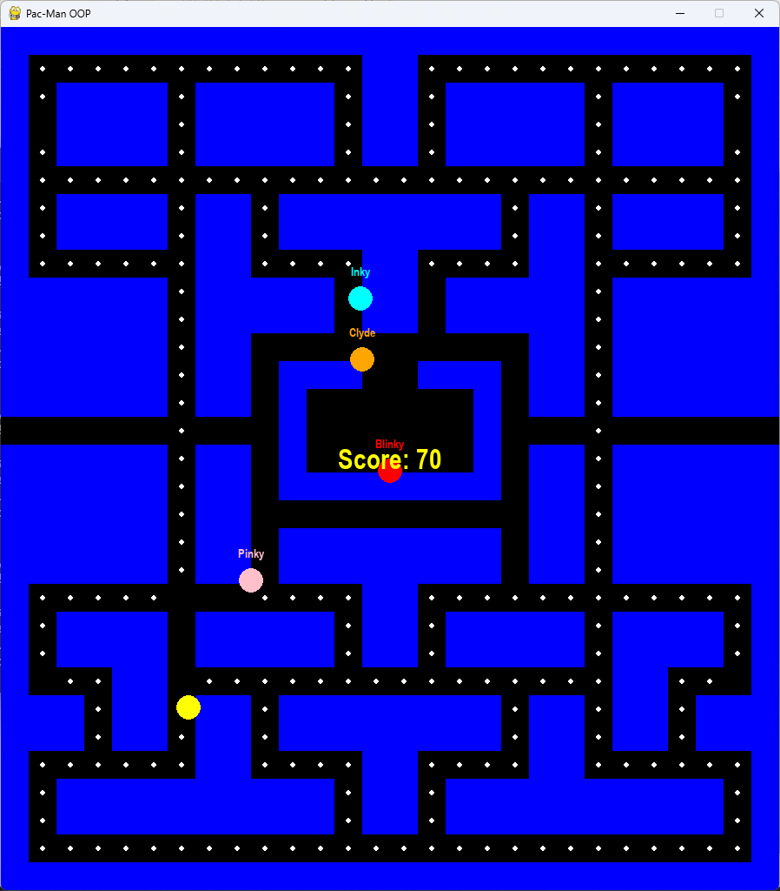
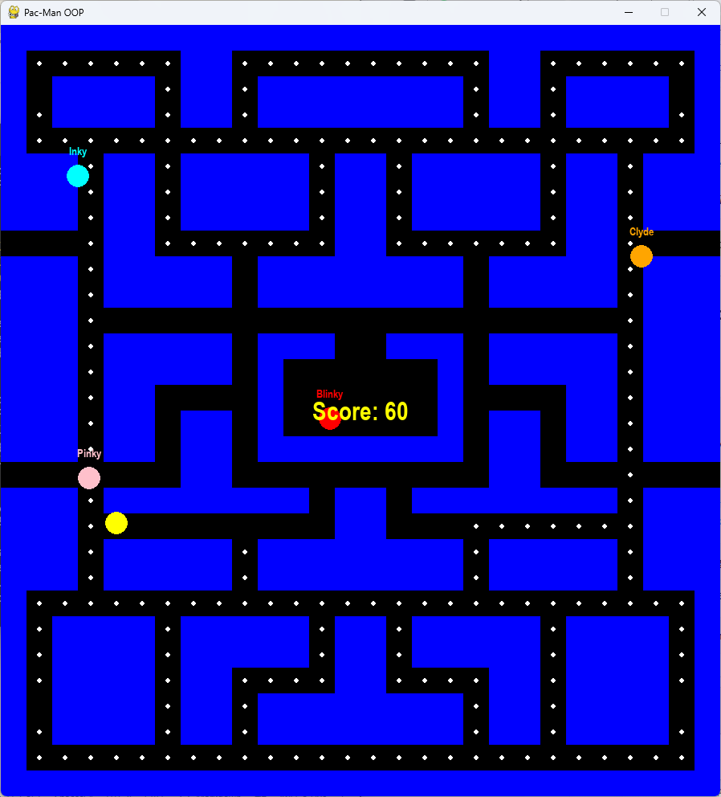

# Pac-Man Clone (Pygame)

A simple Pac-Man-style game built with Python and Pygame using Object-Oriented Programming.

## 🎮 Features

* Basic ghost AI *(work in progress)*
* Sound effects
* Classic Pac-Man and Ms. Pac-Man style mazes loaded from file:

  * `data/pacman.txt`
  * `data/mspacman.txt`
* Configurable settings via `settings.py`:

  * Select which map to load
  * Adjust movement speed
  * Change window size
  * Toggle ghost name display

## ▶️ How to Run

Make sure you have Python and Pygame installed, then run:

```bash
python main.py
```

## 🎮 Controls

* **Arrow Keys** → Move Pac-Man


## 📁 Project Structure (optional but helpful)

```
pac-man/
│── game.py
│── ghost.py
│── grid.py
│── main.py
│── player.py
│── settings.py
│── data/
│   ├── pacman.txt
│   └── mspacman.txt
```


## 📸 Screenshots





## 🚧 Future Improvements

* Snap players and ghosts to the grid
* Warp tunnels on the sides of the map
* Add more complex ghost behaviours
* Add power pellets and frightened mode
* Add a start screen and game over screen
* Add more levels with different mazes
* Add a high score system
* Improve graphics/animations
* Multiplayer mode with 2 players controlling different characters

---

Feel free to fork or contribute!
